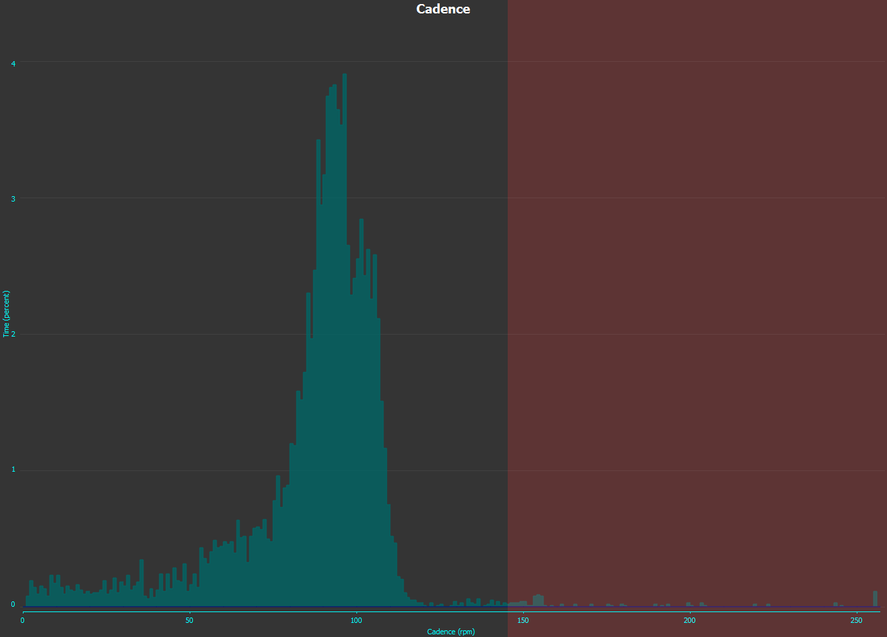
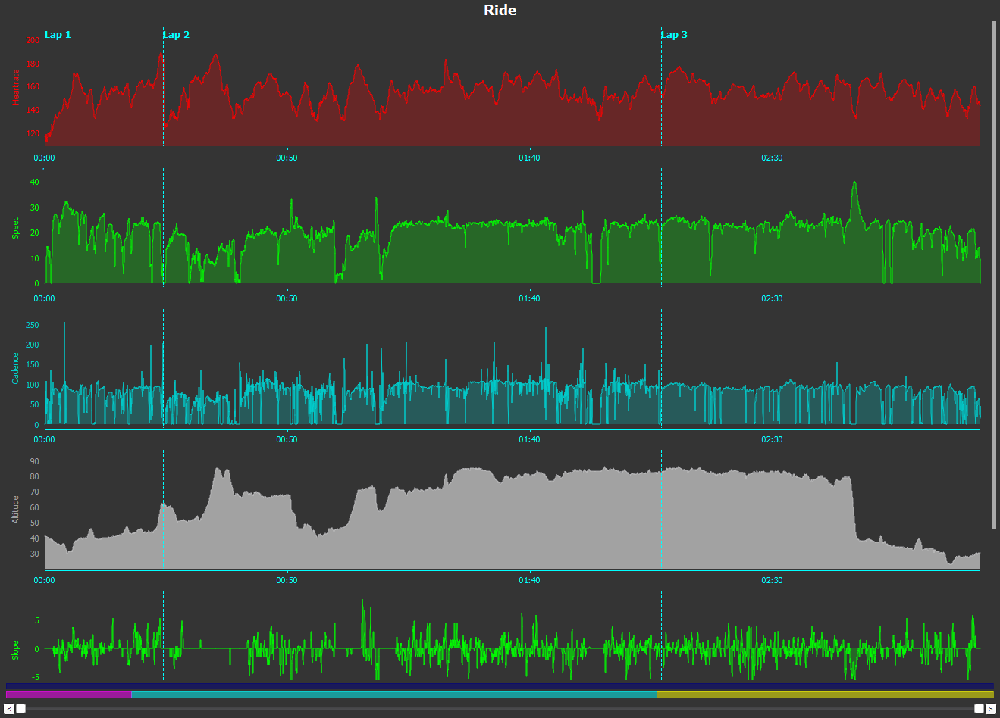
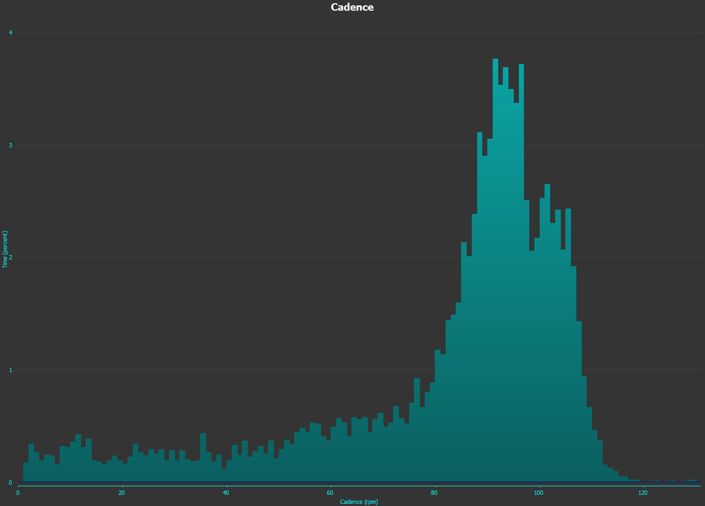
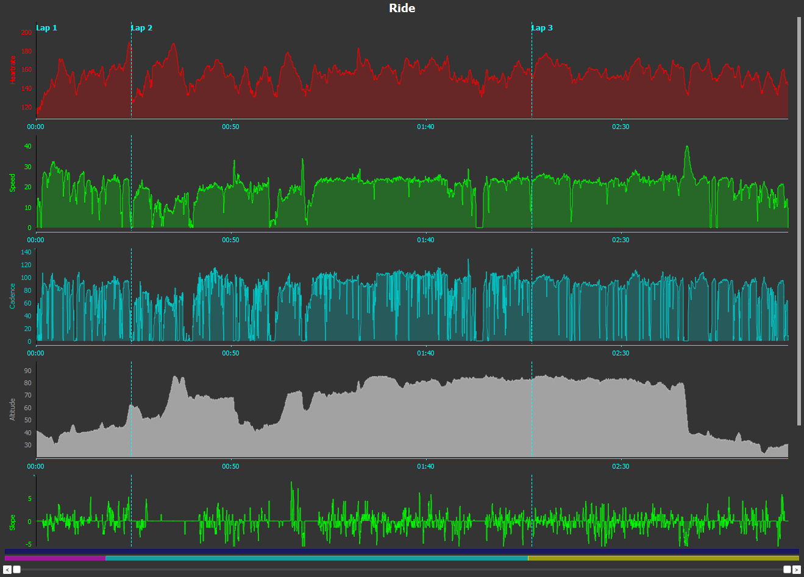

# Cadence anomaly

## Analiza
Czy analizowaliście dane napływające z czujników, np. kadencji?
Moje pierwsze pytanie to dlaczego maksymalna kadencja wynosi 255, przez pewien czas pozostawało bez odpowiedzi do przedwczoraj.

Dane napływają z czujnika co sekundę i pierwszy wykres sporządzony przez program Golden Cheetah 3.3, przedstawiają dane z całego treningu takie jakie wpływały.
Zainteresowało mnie dlaczego ten wykres tak wygląda, dlaczego prawe ramie jest takie długie, przecież większość danych posiada rozkład wg. krzywej Gaussa (mniej więcej).

        
        
        </img>

## Korekta
Zabrałem się więc za bebechy krzywej z poziomu programu GC3.3. I co się okazało? Kilka ciekawych wyjątków.
1. nagłe skoki wartości gdy wartości poprzednia i następna są kontynuacją a ten skok powinien zawierać się między nimi
2. bezsensowne wartości 255, pojedyncze, w parach i w trójkach
3. tzw. trzysekundówki, potrójne (te same) wartości często także absurdalnie wysokie, które poprzedzają normalne dane, a kończą się zerem lub inną liczbą

Wykresy na dole przedstawiają trening po korekcji kadencji, gdzie wartości maksymalne (to te na końcu wykresu po prawej stronie) występują w towarzystwie ich kontynuacji. Po korekcji uzyskuje prawidłową wartość maksymalnej kadencji, a także niezawyżoną wartość średniej. 

        
        
        </img>

